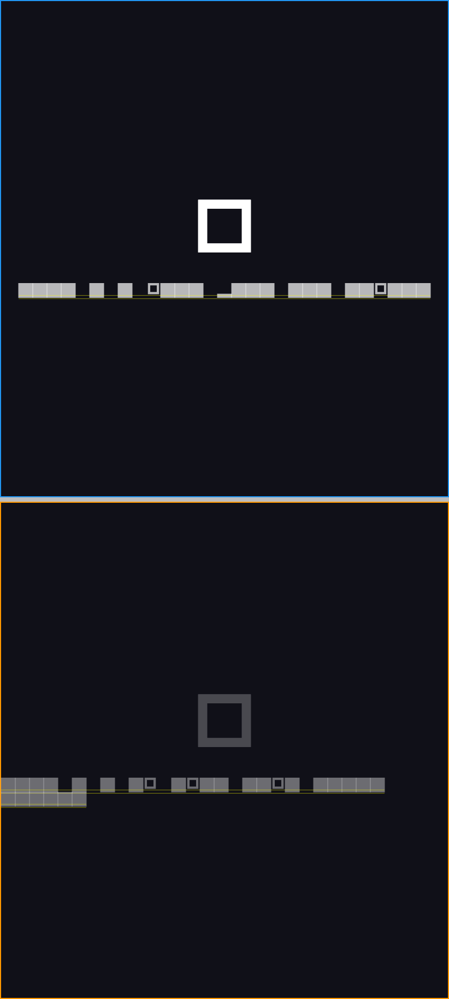
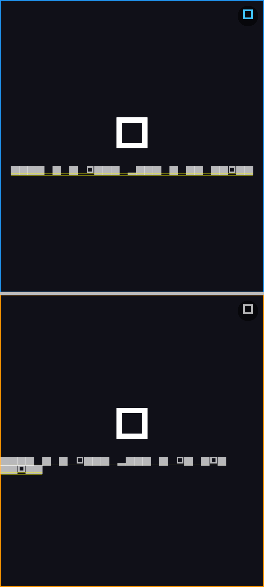

# Issue #20 — Play two videos at once in split view / multiple tabs

## Root cause (recap from the issue)

Android WebView / Chromium grants **audio focus to one media session at a time**.
When a second video starts, it requests audio focus, the first WebView receives
`AUDIOFOCUS_LOSS`, and Chromium auto-pauses it. Both WebViews are alive — this is
not a dispose bug.

## Fix — Option A (mute-based)

A muted `<video>`/`<audio>` does **not** request audio focus, so muted panes never
steal focus from the pane that currently owns sound. We therefore keep exactly one
"audio owner" and mute everything else. Both panes keep rendering their picture;
only one is audible.

- **State:** `TabState.audioTabId` names the single audio-owning tab;
  `TabState.isTabMuted(id)` derives per-pane mute. `null` = all muted.
  (`lib/features/tabs/bloc/tab_state.dart`)
- **Defaults / invariant:** the active tab owns audio; opening, switching, and
  restoring tabs move ownership to the focused tab. `SetAudioTabEvent` toggles the
  owner — tapping a different pane gives it sound and mutes the rest; tapping the
  current owner mutes everything. At most one pane is ever unmuted.
  (`lib/features/tabs/bloc/tab_bloc.dart`)
- **Enforcement:** `WebViewPage.muted` injects JS that sets `.muted` on every
  media element and keeps enforcing it (a `MutationObserver` + `play`/`volumechange`
  listeners) so dynamically added / self-unmuting players stay muted. Re-applied on
  navigation and whenever ownership changes.
  (`lib/features/webview/widgets/webview_page.dart`)
- **UI:** each split pane shows a `SplitAudioToggle` (top-right) — volume-on when it
  owns sound, volume-off when muted.
  (`lib/presentation/pages/home/widgets/split_audio_toggle.dart`,
  wired in `home_page.dart`)

`allowsInlineMediaPlayback` / `mediaPlaybackRequiresUserGesture` were already set
correctly and are unchanged.

### Option B (follow-up, not in this PR)

Both panes audible at once by patching the flutter_inappwebview fork to disable
WebView audio-focus enforcement
(`--disable-features=AudioFocusEnforcement,MediaSessionService`). Needs multi-device
testing and is not guaranteed on every device — tracked as a follow-up.

## Before / After

| Before (bug) | After (fix) |
|---|---|
|  |  |

Widget-level renders (411×914 portrait split). The panes are placeholders — a real
WebView cannot render headless — and glyphs use the test font; the **after** frame
uses the real `SplitAudioToggle`. **Before:** pane 2 auto-pauses (dim pause icon)
when pane 1 plays. **After:** both panes play (play icon); pane 1's toggle is the
blue "sound on" state, pane 2's is muted. Actual audio behaviour is proven by the
tests below (audio focus needs a real device). Regenerate with:

```bash
flutter test test/evidence/issue20_evidence_test.dart -d flutter-tester
```

## Tests

- `test/features/tabs/tab_audio_test.dart` — BLoC: active tab owns audio; new tab
  takes over; `SetAudioTabEvent` moves sound / toggles off; tab switch follows
  focus; unknown id ignored; close keeps/clears ownership — **8 cases**, each
  asserting the "≤ 1 unmuted" invariant.
- `test/features/tabs/split_audio_toggle_test.dart` — widget: icon reflects mute
  state, tap fires callback, accessible label — **4 cases**.
- `integration_test/issue20_split_audio_test.dart` — E2E: two-pane layout driven by
  the real `TabBloc` + `SplitAudioToggle`; toggling keeps exactly one pane with
  sound across the whole flow — **1 case**.

All pass headless via `flutter test … -d flutter-tester`. The E2E test was **also
run on a real Android emulator** (Android 15 / API 35, `emulator-5554`) — see
[`android-integration-test.log`](android-integration-test.log):

```
Running Gradle task 'assembleDebug'... 15.7s
✓ Built build/app/outputs/flutter-apk/app-debug.apk
00:56 +1: All tests passed!
```

## Acceptance mapping

- [x] Split view: both videos keep playing (neither auto-pauses) — muted panes
      never grab audio focus.
- [x] A mechanism to pick which pane has sound — per-pane `SplitAudioToggle`,
      enforced single owner.
- [x] E2E audio-owner flow verified on Android (API 35 emulator).
- [ ] Android 8/10/13 physical-device matrix — pending manual QA to confirm the
      audio-focus behaviour on those OS versions specifically.
